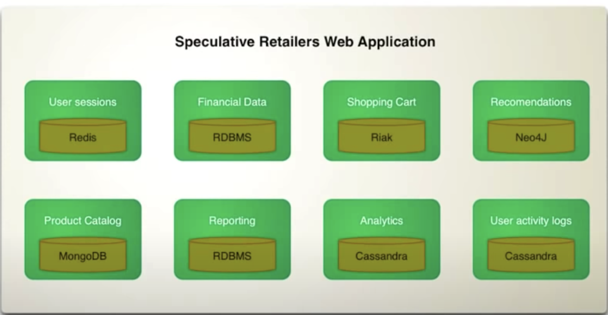

## History of NOSQL
Following papers led to NOSQL movement
Google -> Bigtable
Amazon -> Dynamo

### Categories of NoSql
- Key-value - think of it distributed hashmap
- Document 
- Column family
- Graph
#### When to use NOSQL?
- Large scale data

#### CAP Theoram
Throrem says, in a distributed systems, chose any of these two:
- Consistency
- Availability
- Paritition

Or in Marin Fowler words, if you network goes down(partition), either chose consistency or availability. You can have a mix of two, but it's totally down to the business requirements. For example in two node cluster of hotel management, if network goes down, you can either tell customers that you cannot shop or have the room booked by both nodes.
### Cassandra

- It is really fast to write, see following data model on how it writes to the files.
- Time series data is really good is cassandra as cassandra writes data on disc in order.


Cassandra explicitly chooses not to implement operations that require cross partition coordination as they are typically slow and hard to provide highly available global semantics. For example Cassandra does not support:

  Cross partition transactions
  Distributed joins
  Foreign keys or referential integrity.

- Every node is indepeldent

## Operations on one node
### How it writes data for first time?
```sql
update users
set name='moeen'
where id='mctds'
```
1- Append this to commit log. As this is append only, this is really fast.
2- Write it to memtable now. Memtable is structure base on the User table. It is identified by the primary key and then it will have all the columns for the data. This will represet that row of storage table.
3- Now return to the client saying I have written the data.
4- So far, record is only written in log and in memory in memtables. As those memtables start to fill up, cassandra will flush them. It will write that memtable to datafile called sstable (sorted string table). It will write it using sequential Write. Note it will not write using randome io as Relational Databases do. It will also write the data in order so next time you read it, it is already in order. This file is immutable. The how do we update the file.
### How it updates the data
```sql
update users
set name='mo'
where id='mctds'
```
1- Add new data to new data files sequential
2- Always read data from new data files
3- Compaction
  a- Rad all the data files in memtable for that sstable.
  b- merge them using merge sort on the timestamp
  c- write new merged file on the disc
  d- delete the old files

### Partitioning
- Primary key determines where data will go.
- Apply MD5 has to primary key, this will give you 128-bit number for keys of any size.
- Assign ranges to your nodes based on the equal parts of that 128 bit number.
    

### Troubleshooting 
- How do I know if my data model is good?  
test it using tools like no-sql 'bench' and tlp 'stress'. As long as partition stays in thousand of MBs, we are good.
- How do I change primary key?  
Create new table with new primary Key
Move the data
Start doing shadow writes
Once the data is syncronised, start using new table
