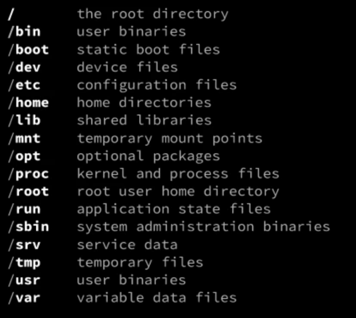

# Notes on Linux
## General points
- Centos is a fork of redhat
- Ubuntu is fork of debian

## Commands:
### Basic
man hier  > help about file system hierarchy  
  
```
yum > Yellowdog update manager  
apt > Advance packaging tool  
dnf > A rewrite of yum and default package manager for fedora  
last > See loging and logout information  
uptime > information about how long the machine is up for  
```
### Archive
```
for i in {1..100}; do touch test_file_$i; done > loop with a range  
tar cf archive.tar test_file_* > create tar
tar tf archive.tar > view(tail) the contents for tar
tar xf archive.tar > extract all files
tar xf archive.tar file3 > extract only one file
tar rf archive.tar file3 > add file3 to tar
tar xf archive.tar --wildcards 'test_file_?' > only extract files that start with test_file_ and git only one digit after that
tar --delete --file=archive.tar file2 > delete file2 from tar
```
### Compression
```
tar czf archive.tar.gz file* > 'create gzip file' > compress in gzip format
tar cjf archive.tar.gz file* > 'create bzip2 file' > compress in bzip2  format
zip -r archive.zip file* > create zip file
```

## Install Package
### RPM
```
sudo rpm -i htop-2.2.0-3.el7.x86_64.rpm
sudo rpm -e htop
```
### DEB
```
sudo dpkg -i htop_2.0.2-1_amd64.deb
sudo dpkg --remove htop
```
### From Source
```
 tar xzf htop-2.2.0.tar.gz
cd htop-2.2.0
./configure
make
sudo make install
sudo make uninstall
```
## Hardware
```
cat /etc/issue > Display Ubuntu version
cat /proc/cpuinfo > display cpu information
cat /prov/version > Display version of os
free -m > See free memory
df -h > 
ifconfig > need to install setup-tools to see network interface
```
## Where data is stored?
### Configuration
```
/boot > Kernel related files - have a look at all the files to get familiar with
/boot/config-5.8.0-38-generic > get boot related configuration
/boot/grub/grub.cfg > 
/etc/fstab > config related to mounted devices
blkid > Get uuid against block devices
/etc/passwd > get list of all the users
/etc/group > get list of all the groups
/etc/hosts > list of all the hosts
/etc/resolv.conf > this is where we specify name server
/etc/vim/vimrc > common vim settings
/sys > datastructure for Kernel
mount | grep sysfs > see where this is mounted
```
### Processes
```
/proc > 1 directory for each process running on the machine
/proc/2872/status > 
/proc/self/status 
/proc/self/status
```
